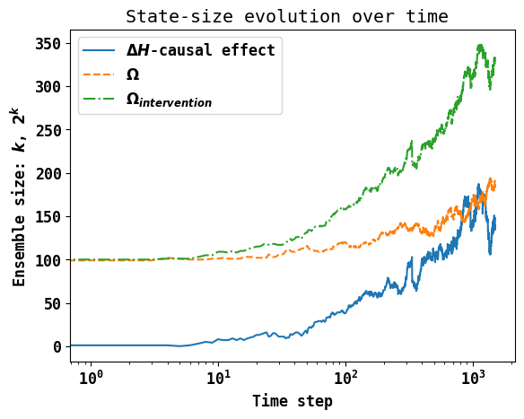

# H-theorem do-conjecture : Supplementary material   

Supplementary material for `H-Theorem do-conjecture` [arXiv:2310.01458](https://arxiv.org/abs/2310.01458). 



## `do_ensemble` Module

The following functionality is provided by the module.

* `initialise` : Would initialise sites.
* `move_step`: Single-spin-flip on a a game
* `move_step_intervention`: Dual-spin-flip on a a game
* `simulate_single_spin_flip_game`: Demo of dynamic evolution.
* `simulate_interventional_ensemble_effect`: H-theorem do-conjecture test

## Run Simulations

Simply run 

```Python
python simulate.py
```

Tested on Python `3.9.16`, use requirement for correct Numpy/Matplotlib versions.

## License 

```
    Mehmet Suezen
    (c) 2023
    GPLv3
```